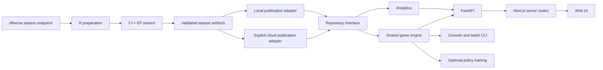

# Architecture

## Responsibilities

Configuration names the provider, data root, optional neural checkpoint, and cloud connection settings. Request models validate state and parameters. Analytics constructs curves and decision comparisons from normalized records. The shared engine handles sampling, scoring, downs, possession, special teams, and conversions. The same `advance` method is used by browser requests, console play, batch simulation, and training.

Storage-specific reads and writes live in adapters. The API and engine know neither SQL connection details nor Supabase URLs. Preparation emits portable CSV/JSON artifacts; normalization validates them before publication. A manifest marks a season ready. Runtime startup is independent of preparation and starts without any dataset or model.

Generation uses an isolated build directory and a process lock to prevent competing local builds. Raw snapshots are cached per season; processed caches are isolated within a build. Parameters, lockfiles, source hashes, compiler/R versions, and artifact hashes describe a build. C++ output is sorted before final artifact hashing. SQLite publication occurs in one season replacement transaction. Cloud publication is deliberately separate and has readiness gating rather than transaction guarantees.

## Modeling and behavior changes

The R distribution preparation and recursive normalized C++ EP solvers are retained from the original project. Sparse team bins use league/neighbor fallback observations. Both offense and defense preparation now use one parameterized script, and league fallback observations come exclusively from the explicitly selected season. Rankings reproduce the notebook's first-down weighted AEP approach using frequency weights generated from that season rather than a copied historical frequency file.

The refactor also corrects behavior that previously differed between implementations:

- C++ coaching weights are read as floating-point values; the old integer parser truncated fractional probabilities.
- Interactive, batch, and training plays use the same regularized league-relative offense/defense product; see [simulation design](simulation.md).
- Field goal success is sampled from the selected season's prepared probabilities, rather than being guaranteed below a hardcoded yardline threshold.
- Punt and field-goal preparation are regenerated from the selected season; sparse observations use nearby-yardline or league pooling.
- Made field goals switch possession once. Safeties, turnover-return touchdowns, touchbacks, and final-play conversions share one transition implementation.
- Optimal play selection masks field goals/punts outside modeled down/field constraints.
- Empty distributions and unavailable datasets raise explicit errors rather than silently producing zero yards or random weights.
- Optional policy training uses the retained network architecture, the shared engine, and discounted score-margin rewards, including opponent responses. It no longer overrides PyTorch's standard `train()` method.

Because these changes fix parsing and unify different engines, regenerated numerical results should not be expected to match historical bundled CSVs exactly. This remains a statistical football model. Clock-based games include quarters, approximate runoff, timeouts, halftime, and regular-season overtime; the legacy play-budget mode remains explicit. Penalties and a complete NFL rules engine are not implemented. See [simulation design](simulation.md) for assumptions and limitations.

## Validation boundaries

Offline tests cover storage parity/pagination, API contracts, empty-data startup, input validation, seed behavior, game transitions, artifact completeness, rejected imports preserving the previous dataset, R syntax, and C++ fractional-weight handling using fabricated fixtures. Frontend lint, TypeScript, and production build run without database credentials.

Real-season downloading/regeneration, real matchups, cloud migration/publication, and model training are manual operations and are not part of these checks. Test success validates the wiring and regressions; it is not a live-data or statistical-model accuracy evaluation.
